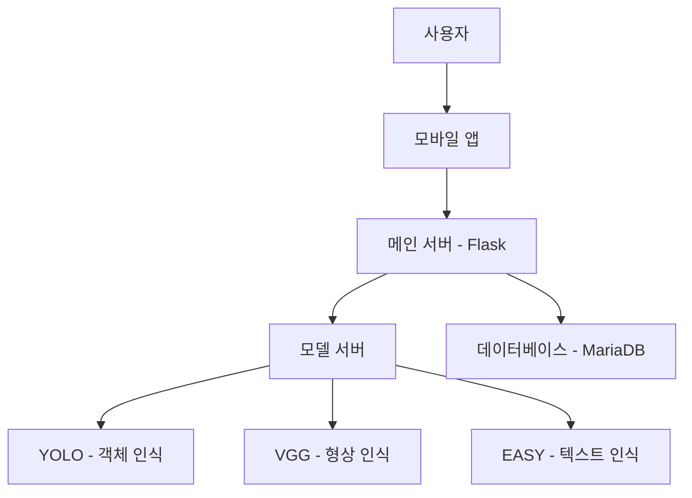

# 알약 정보 알림e (Pill-AI-Notification-System)
알약 정보를 쉽고 빠르게 확인할 수 있는 AI 기반 의약품 정보 제공 서비스

## 📋 프로젝트 소개
알약 정보 알림e는 AI 딥러닝 기술을 활용하여 의약품 이미지를 인식하고, 해당 의약품의 정보를 즉시 제공하는 모바일 애플리케이션입니다. 사용자는 알약의 사진만 찍으면 효능, 용법, 주의사항 등 필요한 정보를 쉽게 확인할 수 있습니다.

### 기획 배경
- 국민 6명 중 1명이 약물 오남용 경험
- 65세 이상 44%가 매일 5개 이상 약 복용
- 의약품 혼용 금지 조합 및 부작용에 대한 정보 접근성 부족
- 처방약 정보를 잊어버리거나 출처가 불분명한 약에 대한 정보 필요

## 📊 요구사항 분석

### 설문조사 개요
- 총 응답자 수: 217명
- 조사 항목: 약의 정보 필요성, 앱 사용 의향, 주요 사용 목적, 선호 기능 등

## 👥 팀 구성 및 역할

### UI/UX 디자인
- 허창연
  - UI/UX 디자인 
  - Figma UI 디자인
  - VGG 모델 학습
  - 앱 개발

### AI/서버 개발
- 김현규
  - 모델 서버 개발
  - 메인 서버 개발
  - YOLO 모델 학습
  - EASY 모델 학습
  - VGG 모델 학습
  - 앱 개발

### 백엔드 개발
- 정재호
  - 백엔드 개발
  - 데이터베이스 구축
  - 메인 서버 개발
  - 앱 개발

### 안드로이드 개발
- 이태석
  - 안드로이드 UI 기능 구현
  - 데이터베이스 구축
  - YOLO 모델 학습
  - EASY 모델 학습
  - VGG 모델 학습

### 복용약 관리
- 김세찬
  - 안드로이드 개발
  - 복용약 관리 기능
  - 앱 개발

## ✨ 주요 기능

### 1. 알약 식별
- 카메라로 의약품을 촬영하여 이미지 인식
- AI 딥러닝 기술을 통한 정확한 알약 식별
- 다양한 검색 방식 지원 (이름, 증상, 카메라 촬영)

### 2. 의약품 정보 제공
- 의약품 기본 정보 (효능, 용법, 주의사항)
- 복용 알림 설정 기능
- 상호작용 정보 제공

### 3. 접근성 강화
- 직관적인 UI/UX 설계
- 복용 시간 알림 기능
- 알약 상호작용

## 🛠 기술 스택

### Frontend
- JAVA 안드로이드 앱 개발
- UI/UX 디자인: Figma

### Backend
- Flask 메인 서버, 모델 서버
- MariaDB 데이터베이스
- API 통합 및 관리

### AI/ML
- YOLO (객체 인식)
- VGG (형상 인식)
- EASY (텍스트 인식)
- RGB 분석

## 📱 시스템 아키텍처

## 🎯 대상 사용자
- 약사 및 의료 종사자
- 다수의 약을 복용하는 환자
- 복용 정보를 잊어버린 사용자
- 약을 관리해야 하는 간병인
- 어린이를 둔 부모

## 📊 데이터베이스
- 경구(고형제) 등록 현황: 31,870개
- 약학정보원 데이터 활용
- 식품의약품안전처 공공데이터 API 연동
- 보건복지부 데이터 활용
  
## 📌 참고 자료
- [약학정보원](https://www.health.kr/)
- [식품의약품안전처_의약품개요정보(e약은요)](https://www.data.go.kr/data/15075057/openapi.do)

## 📞 문의사항
- 김현규 : khgg010@naver.com
- 허창연 : gjckddus@gmail.com
- 김세찬 : sechanstark@naver.com
- 정재호 : wogh916@naver.com
- 이태석 : ttym789@naver.com

